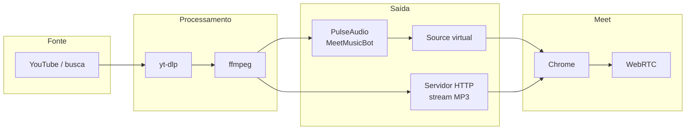

# Meet Music Bot

[](https://opensource.org/licenses/MIT)
[](https://github.com/samuelrms/meet-bot/actions/workflows/ci.yml)
[](https://nodejs.org/)

Bot de música para **Google Meet** no Linux: microfone virtual (PulseAudio/PipeWire), **Puppeteer**, **yt-dlp** e **ffmpeg** para tocar áudio do YouTube na sala em que você participar.

## Documentação

| Recurso                              | Local                                                                                |
| ------------------------------------ | ------------------------------------------------------------------------------------ |
| Índice da documentação               | [docs/README.md](docs/README.md)                                                     |
| Arquitetura e camadas                | [docs/ARCHITECTURE.md](docs/ARCHITECTURE.md)                                         |
| Diagramas Mermaid (fluxos completos) | [docs/diagrams/meet-music-bot-overview.md](docs/diagrams/meet-music-bot-overview.md) |
| Testes e cobertura                   | [docs/TEST_REPORT.md](docs/TEST_REPORT.md)                                           |
| Ideias futuras (backlog)             | [TODO/melhorias.md](TODO/melhorias.md)                                               |

## CI e testes

- **GitHub Actions:** `.github/workflows/ci.yml` — instala dependências, compila, executa testes com cobertura e gera o tarball com `pnpm pack` (Node 20 e 22).
- **Local:** scripts `test` e `test:watch` no `package.json`.

## Visão geral (fluxo de áudio)



Fluxogramas adicionais (CLI, sequência `!play` → injeção): ver **docs/diagrams** acima.

## Pré-requisitos

- Ubuntu / Debian (ou derivados)
- Node.js 18+ (alinhado ao Vitest e ao CI)
- PulseAudio ou PipeWire (PipeWire com `pipewire-pulse`)
- FFmpeg
- yt-dlp
- Chromium ou Google Chrome
- Xvfb (uso típico do Puppeteer com display virtual)

## Instalação

```bash
cd meet-music-bot
chmod +x setup.sh
./setup.sh
pnpm install
```

## Uso

```bash
pnpm start
```

O script **start** compila o TypeScript e executa `dist/index.js`. Para só compilar: `pnpm run build`.

## Comandos da CLI

| Comando                 | Descrição                     |
| ----------------------- | ----------------------------- |
| `!join <url ou código>` | Entra em uma sala do Meet     |
| `!name <nome>`          | nome de visitante             |
| `!play <url ou nome>`   | Toca música (adiciona à fila) |
| `!skip`                 | Pula a música atual           |
| `!pause`                | Pausa                         |
| `!stop`                 | Para e limpa a fila           |
| `!queue`                | Mostra a fila                 |
| `!loop`                 | Ativa/desativa loop           |
| `!clear`                | Limpa a fila                  |
| `!volume <0-200>`       | Volume                        |
| `!leave`                | Sai da sala                   |
| `!help`                 | Ajuda                         |
| `!quit`                 | Encerra o bot                 |

### Exemplos

```bash
!join https://meet.google.com/abc-defg-hij
!play https://www.youtube.com/watch?v=dQw4w9WgXcQ
!play lo-fi hip hop radio
!volume 60
!skip
!loop
```

## Observações

- O bot usa o **navegador** que o Puppeteer abre, com sessão Google conforme o perfil/permissões da sua máquina.
- Salas com “pedir para entrar” dependem de aprovação do anfitrião.
- Volume padrão **80**; valores acima de 100 amplificam o sinal.

## Solução de problemas

**Falha ao criar microfone virtual** — subir o servidor de som: `pulseaudio --start` ou `systemctl --user start pipewire pipewire-pulse` (conforme o seu sistema).

**Falha ao iniciar o navegador** — instalar Chromium/Chrome, por exemplo via pacote `chromium-browser` ou Google Chrome.

**Sem som no Meet** — em `pavucontrol`, confira o sink **MeetMusicBot** para o Chrome e o microfone **MeetMusicBotSrc** no Meet.

## Comunidade open source

- **[Contribuindo (CONTRIBUTING)](CONTRIBUTING.md):** Veja nosso guia completo sobre como rodar testes, configurar o Husky, usar _Conventional Commits_ e enviar PRs (que exigem no mínimo 60% de cobertura de testes).
- **[Código de Conduta](CODE_OF_CONDUCT.md):** Esperamos que todos os membros da nossa comunidade sigam este código.
- **[Política de Segurança](SECURITY.md):** Instruções sobre vulnerabilidades.
- **[Licença (MIT)](LICENSE):** O código é licenciado pela Samuel Ramos. Consulte a licença para mais termos.
