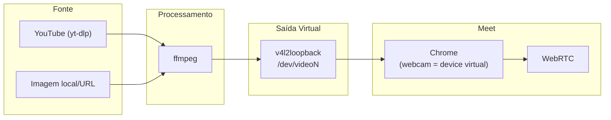
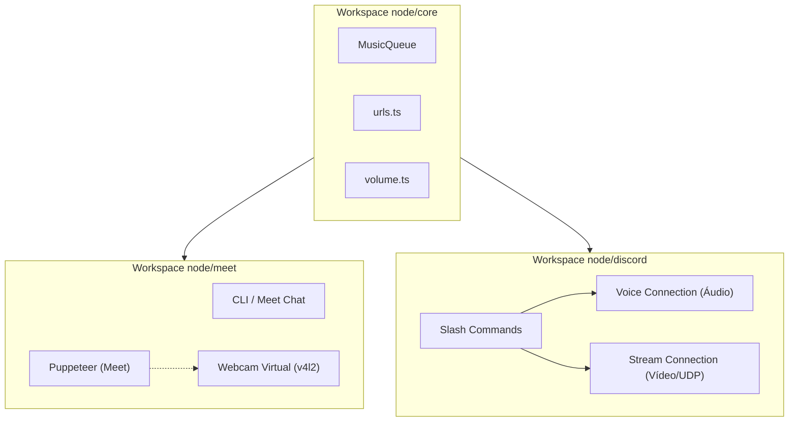

# Meet Music Bot — Plano Completo

Como pré-requisito, faremos a **Reestruturação Monorepo** para separar implementação `node/` e futura `rust/`.

---

## Fase 1 — Bypass Noise Suppression ✅ Feito

Código implementado. Pendente apenas `pnpm install` + `pnpm run build` + `pnpm run test` quando a rede normalizar.

Mudanças feitas:
- Chrome flags `WebRtcApmInAudioService` e `ChromeWideEchoCancellation`
- `injectAudioStream` reescrito com Web Audio API (`AudioContext` → `createMediaStreamDestination`)
- `_disableNoiseCancellation()` automático via Puppeteer
- Delay de injeção reduzido de 4s → 1s
- TODO Rust documentado em `TODO/melhorias.md`

---

## Fase 1.2 — Estrutura Monorepo (Preparação)

### Conceito
Antes de criar o bot do Discord ou injetar código complexo de vídeo, dividiremos o repósitorio. Hospedaremos o core lógico separado das plataformas, sob uma estrutura que espelhe a futura migração para Rust.

### Estrutura de Pastas

```text
meet-bot/
├── node/                  # Implementações em NodeJS / TypeScript
│   ├── core/              # Fila (MusicQueue), helpers (urls, volume) — framework agnóstico
│   ├── meet/              # Bot do Meet (Puppeteer, Web Audio API, chat)
│   └── discord/           # Bot do Discord (discord.js, streaming de mídia)
├── rust/                  # (TODO futuro) Implementações em Rust
│   ├── core/              
│   ├── meet/              
│   └── discord/           
├── docs/
└── TODO/
```

- Adotaremos o recurso de **pnpm workspaces** para referenciar `node/core` dentro de `node/meet` e `node/discord`.

---

## Fase 1.5 — Comandos via Chat do Meet

### Conceito
Permitir que os usuários enviem comandos (ex: `!play URL`, `!skip`, `!volume 50`) diretamente **pelo chat público do Google Meet**. O bot lerá as mensagens, executará os comandos e enviará feedback de volta no chat.

### Proposed Changes

#### [meet.ts](https://github.com/samuelrms/meet-bot/blob/main/src/meet.ts)

1. **`MeetBot.onChatMessage((sender, text) => void)`:**
   - Injetar no contexto do browser um script com `MutationObserver`.
   - Monitorar elementos do chat (normalmente `div[aria-live="polite"]` ou filhos sendo adicionados).
   - Usar `page.exposeFunction` para repassar a mensagem capturada ao contexto NodeJS.

2. **`MeetBot.sendMessage(text: string)`:**
   - **Abrir o painel do chat** (se estiver fechado) clicando no botão do chat (`[aria-label="Chat com todos"]`, `[aria-label="Chat with everyone"]`).
   - Focar no input de chat (`textarea` para mensagens).
   - Usar `page.type()` para inserir o texto e `page.keyboard.press('Enter')` para enviar.

#### [index.ts](https://github.com/samuelrms/meet-bot/blob/main/src/index.ts)

- Conectar o evento `bot.onChatMessage` ao mesmo fluxo de `rl.on('line')` que já lê comandos do terminal.
- Quando a origem do comando for o chat, o bot usará `bot.sendMessage("🎵 Tocando: ...")` para responder na reunião.

---

## Fase 2 — Webcam Virtual (Vídeos e Imagens no Meet)

### Conceito

Criar uma **câmera virtual** via `v4l2loopback` que o Chrome usa como webcam. O bot envia vídeos do YouTube ou imagens para essa câmera via `ffmpeg`, permitindo exibir conteúdo visual para os participantes do Meet.

### Arquitetura



### Proposed Changes

#### [NEW] [video.ts](https://github.com/samuelrms/meet-bot/blob/main/src/video.ts)

Novo `VideoManager` com responsabilidades:

```typescript
export class VideoManager {
  // Setup do v4l2loopback
  async setup(): Promise<boolean>;
  
  // Tocar vídeo (YouTube URL ou arquivo local) no device virtual
  playVideo(url: string): Promise<void>;
  
  // Exibir imagem estática (URL ou path) no device virtual
  showImage(path: string): Promise<void>;
  
  // Parar vídeo/imagem
  stop(): void;
  
  // Cleanup
  async teardown(): Promise<void>;
  
  get devicePath(): string; // ex: /dev/video2
}
```

**Implementação-chave:**

1. **Setup v4l2loopback:**
```bash
sudo modprobe v4l2loopback \
  exclusive_caps=1 \
  video_nr=10 \
  card_label="MeetMusicBotCam"
```

2. **Enviar vídeo (yt-dlp → ffmpeg → v4l2loopback):**
```bash
yt-dlp -o - URL | ffmpeg -i pipe:0 \
  -vf "scale=1280:720,format=yuv420p" \
  -f v4l2 /dev/video10
```

3. **Enviar imagem estática (loop infinito):**
```bash
ffmpeg -loop 1 -i image.png \
  -vf "scale=1280:720,format=yuv420p" \
  -r 1 -f v4l2 /dev/video10
```

---

#### [meet.ts](https://github.com/samuelrms/meet-bot/blob/main/src/meet.ts)

- **Opção A (recomendada):** Adicionar flag `--use-file-for-fake-video-capture` apontando para o device v4l2loopback. Chrome usa diretamente como webcam.
- **Opção B:** Manter Chrome normal e selecionar o device virtual como câmera via Settings. Mais frágil, depende da UI do Meet.
- Adicionar `_enableCamera()` para ligar a câmera quando houver vídeo/imagem sendo transmitido.

---

#### [index.ts](https://github.com/samuelrms/meet-bot/blob/main/src/index.ts)

Novos comandos CLI:

| Comando | Descrição |
|---------|-----------|
| `!video <url ou busca>` | Toca vídeo do YouTube na webcam virtual |
| `!image <url ou path>` | Exibe imagem estática na webcam |
| `!videostop` | Para vídeo/imagem e desliga a câmera |

---

#### [setup.sh](https://github.com/samuelrms/meet-bot/blob/main/setup.sh)

Adicionar instalação de:
- `v4l2loopback-dkms` (módulo kernel)
- `v4l2loopback-utils` (ferramentas auxiliares)

---

### Requisitos do Sistema (Fase 2)

- Linux com acesso a `modprobe` (precisa de sudo na primeira vez)
- `v4l2loopback-dkms` instalado
- `ffmpeg` (já é requisito)

---

## Fase 3 — Bot Discord (Áudio, Vídeo e Imagens)

### Conceito

Bot Discord separado (`node/discord/`) que reutiliza o **core compartilhado** (`node/core/`). 
O Discord suporta streaming de áudio nativamente por bots (via `@discordjs/voice`), mas **streaming de vídeo por bots requer libs específicas** (já que a biblioteca oficial foca apenas em áudio). Usaremos soluções WebRTC/UDP customizadas para Discord (como `discord-video-stream` ou similar) para espelhar as capacidades de "Webcam" e "Vídeo" do Meet no Discord.

### Arquitetura



### Proposed Changes

#### Diretório `node/discord/`

```
node/discord/
├── src/
│   ├── index.ts          # Entrypoint: Client, event handlers
│   ├── audio.ts          # DiscordAudioManager (@discordjs/voice)
│   ├── video.ts          # Integrador de Vídeo para Discord (UDP/WebRTC custom stream)
│   ├── commands/
│   │   ├── play.ts       # /play <url>
│   │   ├── video.ts      # /video <url>  <-- Novo!
│   │   ├── image.ts      # /image <url>  <-- Novo!
│   │   ├── skip.ts       # /skip
│   │   ├── queue.ts      # /queue
│   │   └── volume.ts     # /volume
├── deploy-commands.ts
└── package.json (pnpm workspace child)
```

---

#### node/discord/src/video.ts

Para suportar `/video` e `/image` no Discord:
- O client enviará pacotes UDP/RTP com frames de vídeo empacotados pelo `ffmpeg`.
- A comunidade mantém pacotes como `discord-video-stream` que permitem a "Ativação da Câmera" ou "Compartilhamento de Tela" por bots não-oficiais / self-bots com UDP payload mapping.
- Se a API bloquear bots regulares de abrir a "câmera", a alternativa de fallback será que o bot envie os vídeos curtos/imagens diretamente no chat do Discord (upload/embed) enquanto toca o áudio no voice channel.

---

#### Funcionalidades em `node/discord`

| Slash Command | Tipo de Mídia | Descrição |
|---------------|---------------|-----------|
| `/play <query>` | Áudio | Toca áudio no Voice Channel |
| `/video <query>` | Vídeo | Transmite vídeo (se suportado via lib) ou toca áudio + envia link no chat |
| `/image <url>` | Imagem | Ativa câmera virtual discord / Embed da imagem no chat |
| `/skip` | Controle | Pula fila compartilhada |
| `/queue` | Info | Mostra fila (embed) |
| `/nowplaying` | Info | Mostra thumbnail, uploader e tempo |

---

## Ordem de Execução

1. **Agora**: verificar build da Fase 1 (quando rede normalizar)
2. **Fase 1.2**: Reestruturação do Monorepo `node/` e `rust/`
3. **Fase 1.5**: Comandos pelo chat do Meet
4. **Fase 2**: Webcam virtual (~2-3 dias)
5. **Fase 3**: Discord bot (~3-4 dias)
