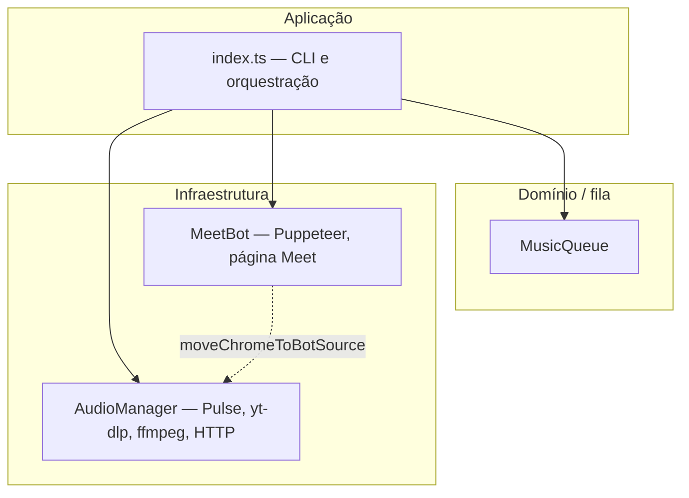

# Arquitetura — Meet Music Bot

## Visão geral

O sistema combina três eixos:

1. **Áudio** — `AudioManager` cria sink/source virtuais no PulseAudio/PipeWire, usa yt-dlp e ffmpeg para decodificar o YouTube e enviar áudio ao sink; em paralelo expõe um stream MP3 via HTTP local para injeção no navegador.
2. **Meet** — `MeetBot` controla o Chrome via Puppeteer, entra na sala, e opcionalmente injeta o stream HTTP no WebRTC substituindo tracks de áudio nas `RTCPeerConnection` monitoradas.
3. **CLI** — `src/index.ts` orquestra fila (`MusicQueue`), comandos interativos e o ciclo `playNext`.

Diagramas Mermaid detalhados: [diagrams/meet-music-bot-overview.md](./diagrams/meet-music-bot-overview.md).

## Camadas (dependência sugerida)

- A CLI depende de `AudioManager`, `MeetBot` e `MusicQueue`.
- `MeetBot` usa `AudioManager` apenas para mover saídas do Chrome para o source virtual após entrar na sala.
- `urls.ts` e `volume.ts` centralizam normalização de URLs e limite de volume; são importados por `AudioManager` e `MeetBot`.

## Fluxo principal de reprodução

1. Comando de play adiciona item à fila (`QueueItem`: título, duração, URL, etc.).
2. `playNext` retira o próximo item, chama `audio.play(url)`.
3. ffmpeg envia PCM/opus para o sink virtual e MP3 para o `PassThrough` servido pelo servidor HTTP.
4. Se `MeetBot.inMeeting` e a porta do stream estão definidas, após um atraso (~4s) chama `injectAudioStream(porta)` para alimentar o Meet via `MediaSource` + `captureStream` + `replaceTrack`.

## Decisões relevantes

- **Bypass WebRTC de captura de microfone**: o áudio “limpo” para os participantes pode vir do stream HTTP injetado, reduzindo dependência do pipeline APM do Chrome para a música.
- **Sink virtual dedicado** (`MeetMusicBot`): isola o volume e o roteamento no mixer (útil com `pavucontrol`).

Para exemplos de uso e comandos com trechos copiáveis, veja o README na raiz do repositório.
