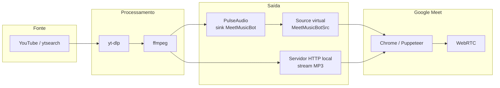
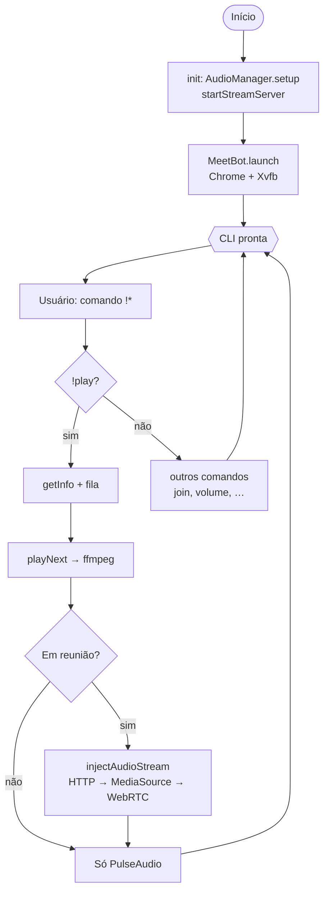
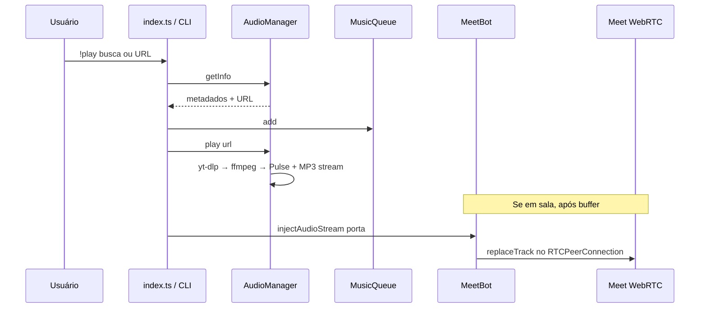

# Meet Music Bot — visão geral (diagramas)

Diagramas Mermaid do fluxo de áudio, da CLI e da integração com o Meet.

## Pipeline de áudio (YouTube → sala)

## Fluxo da CLI (inicialização e reprodução)

## Sequência simplificada: tocar música na fila

